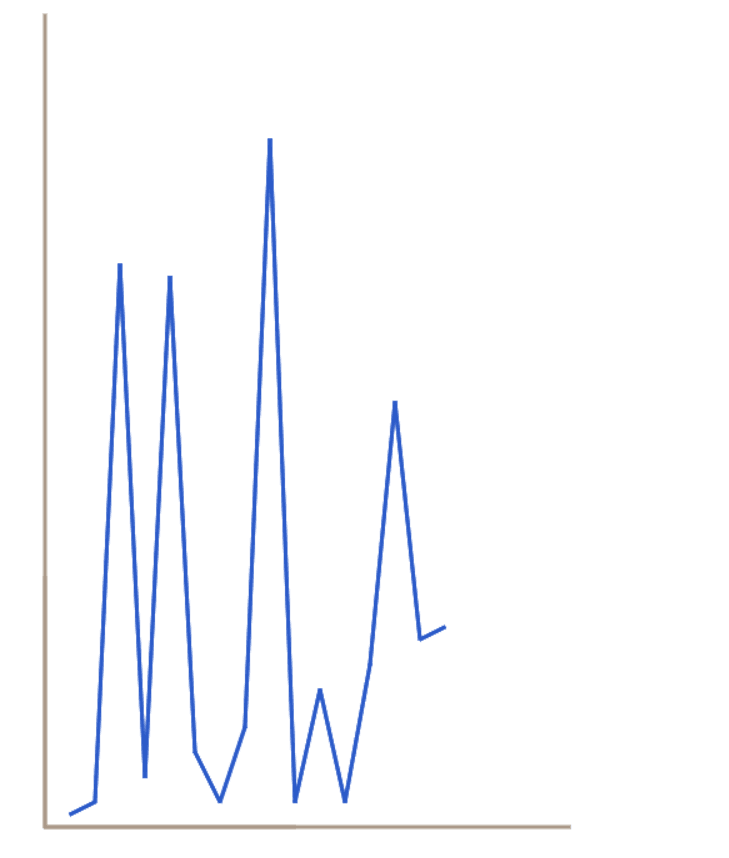

## 介绍
模拟了一个简洁的 类似于 echarts 的前端图像框架的基本构成.

通过分层,它的构成如下:
EasyCharts -> 多张图层 -> 多种图元 -> 多种元素

**元素**通过添加元素 直线,圆,矩形 等绘制算法作为基础.
**图元**接受参数的同时,利用各种元素可以构成不同的复杂图形.
**图层**用于承载和管理图元的集合

它目前拥有:
- 基础可用的骨架
- 图形数据与像素数据隔离
- 数据变化通知机制
  用于坐标系伴随数据增长而变化
- 一种基础图元
折线
- 一种坐标系图元
- 一种直线元素
## 尝试
```shell
git clone https://github.com/dalerkd/EasyCharts.git
cd EasyCharts
npm i
npm run dev
#浏览器打开 http://localhost:1234
```
你将会看到一个坐标系 随数据 增加的一个例子
## 效果


## 挑战
这确实是有一个Demo,但完成它对我来说拥有不小的挑战.

时间、分层设计上.特别是 数据变化后 对坐标系图元的通知机制.我们这里通过注册机制实现了.

这个项目如果继续设计可能会增加很多细节.但是于我们的设计来说帮助不一定大.